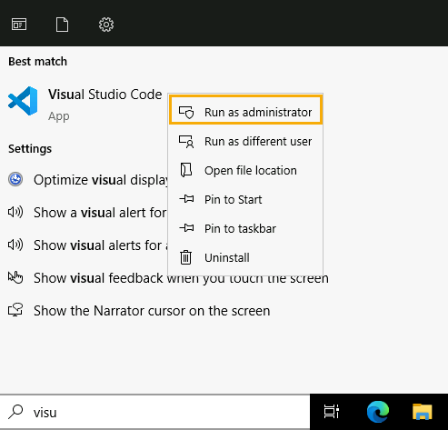
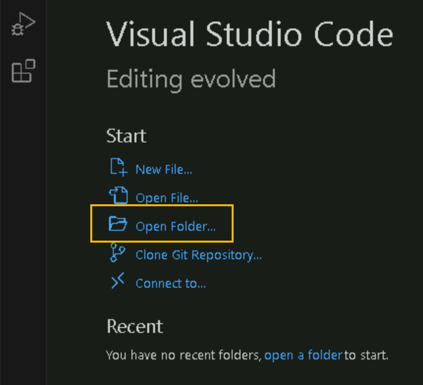
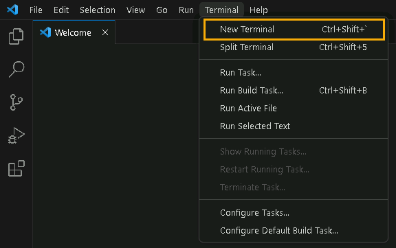
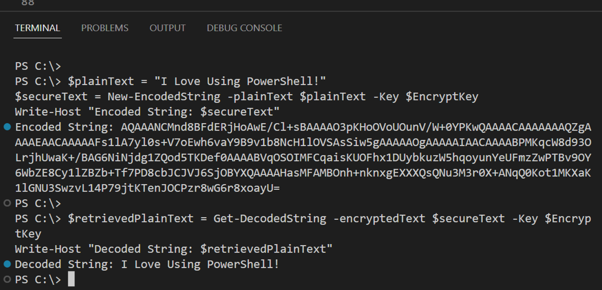
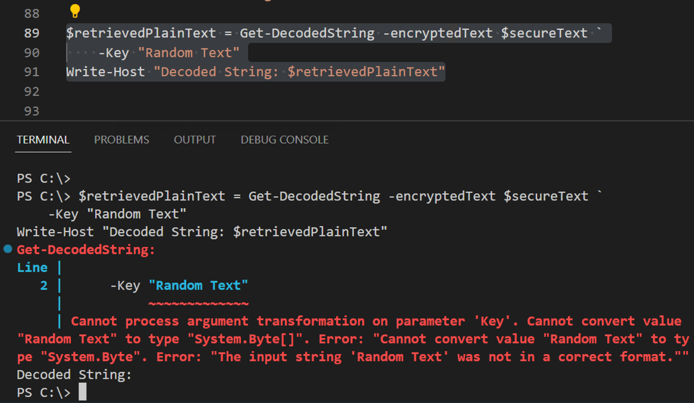

# Challenge: Encoding and Decoding Sensitive String Data using .NET Components in PowerShell with Visual Studio Code

By the end of this challenge, you should be able to integrate .NET libraries within PowerShell to encode and decode sensitive string values using Visual Studio Code.

## Prerequisites

* Basic understanding of PowerShell scripting.
* Access to a Windows environment with Visual Studio Code installed.

## Tasks

1. Launch Visual Studio Code as an **Administrator**.



1. From the Visual Studio Code welcome screen click the **Open Folder option**



2. When prompted, navigate to the **LAB_FILES** folder from the **Desktop**, and select **Select Folder**

3. In the left navigation double click the file `EncodedDecodeScript.ps1` to load it into the main window

4. Click **Terminal** from the top navigation within Visual Studio Code, and click **New Terminal**



5. Ensure the Terminal is set to PowerShell (**pwsh)** by checking the top of the Terminal which is below the main PowerShell script

")

6. The first task is to ensure that the .NET Framework component needed loads into the Terminal you just opened. Select the following line from the top of the script, then click **Terminal** from the menu bar and choose **Run Selected Text**

```powershell
Add-Type -AssemblyName System.Security
```

")

10. Now select the following command from "**Step 2**" in the script and execute in the same way. As you do this, you will see the output within the Terminal window.

```powershell
function New-EncodedString {
    param (
        [Parameter(Mandatory = $true)]
        [string]$plainText
    )
    
    $plainTextBytes = [System.Text.Encoding]::Unicode.GetBytes($plainText)
    $secureText = [Security.Cryptography.ProtectedData]::Protect($plainTextBytes, $null, [Security.Cryptography.DataProtectionScope]::LocalMachine)
    $secureTextBase64 = [System.Convert]::ToBase64String($secureText)

    return $secureTextBase64
}
```

11. Now select the following command from "**Step 2**" in the script and execute in the same way.

```powershell
function Get-DecodedString {
    param (
        [Parameter(Mandatory = $true)]
        [string]$encryptedText
    )
    
    $secureTextBase64 = [System.Convert]::FromBase64String($encryptedText)
    $secureText = [Security.Cryptography.ProtectedData]::Unprotect($secureTextBase64, $null, [Security.Cryptography.DataProtectionScope]::LocalMachine)
    $plainText = [System.Text.Encoding]::Unicode.GetString($secureText)

    return $plainText
}
```

12. To test the `New-EncodedString` and `Get-DecodedString` function, select the following lines from "**Step 3**" within the script and execute as before.

```powershell
$plainText = "I love using PowerShell"
$secureText = New-EncodedString -plainText $plainText
Write-Host "Encoded String: $secureText"
```

13. To decode the new encrypted value, select the following code from "**Step 3**" within the script and execute as before.

```powershell
$retrievedPlainText = Get-DecodedString -encryptedText $secureText
Write-Host "Decoded String: $retrievedPlainText"
```

14. To make this more secure, you can also add an encryption key that is then required to encode and decode the string value.

15. Navigate within the script to "**Step 4**" within the script, copy both the functions and execute as before.

```powershell
function New-EncodedString {
    param (
        [string]$plainText,
        [byte[]]$Key
    )

    $plainTextBytes = [System.Text.Encoding]::Unicode.GetBytes($plainText)
    $secureText = [System.Security.Cryptography.ProtectedData]::Protect($plainTextBytes, $Key, [System.Security.Cryptography.DataProtectionScope]::LocalMachine)
    $secureTextBase64 = [System.Convert]::ToBase64String($secureText)

    return $secureTextBase64
}

function Get-DecodedString {
    param (
        [string]$encryptedText,
        [byte[]]$Key
    )

    $secureTextBase64 = [System.Convert]::FromBase64String($encryptedText)
    $secureText = [System.Security.Cryptography.ProtectedData]::Unprotect($secureTextBase64, $Key, [System.Security.Cryptography.DataProtectionScope]::LocalMachine)
    $plainText = [System.Text.Encoding]::Unicode.GetString($secureText)

    return $plainText
}
```

16. To test the updated function, copy the code from "**Step 5**" within the script and execute as before.

```powershell
$EncryptKey = New-Object byte[] 32
[System.Security.Cryptography.RandomNumberGenerator]::Create().GetBytes($EncryptKey)

$plainText = "I Love Using PowerShell!"
$secureText = New-EncodedString -plainText $plainText -Key $EncryptKey
Write-Host "Encoded String: $secureText"

$retrievedPlainText = Get-DecodedString -encryptedText $secureText -Key $EncryptKey
Write-Host "Decoded String: $retrievedPlainText"
```



17. Notice that if you call the decode option again but this time type a random string value for the key it will fail.

```powershell
$retrievedPlainText = Get-DecodedString -encryptedText $secureText -Key "Random Text"
Write-Host "Decoded String: $retrievedPlainText"
```



Well done on completing this challenge! You've now integrated .NET components into PowerShell for encoding and decoding purposes using Visual Studio Code.
